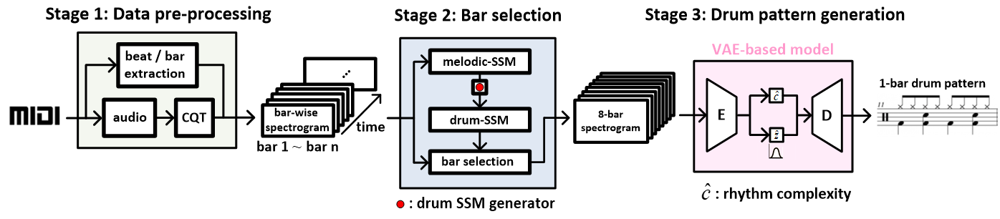

Drum Generation with Self-Similarity Matrix (SSM)
==================

The goal of this project is using machine learning model to generate long drum-track for a given song.
With SSM as song structure representation, we successfully demonstrate that it is possible to generate drum-track with long-term consistency. This project uses Google's [TensorFlow](https://www.tensorflow.org/ "link") and [Jupyter Notebook](https://github.com/jupyter/notebook "link") to make the implementation easier.

## The Flow of Generation

- **Data Pre-Processing**: Melodic-track MIDI data is synthesized into 44.1 kHz mono-channel audio, then, converted and divided into CQT spectrogram on bar basis. Each bar is a 84 x 96 matrix. Drum tracks are down-sampled to 46 x 16 for each bar.
- **Bar Selection**: To encode song structure, 7-nearest bars are identified for every bar-level spectrogram based on drum SSM to provide relevant information for generating rhythm compatible drum patterns.
- **Training**: Selected 8-bar spectrogram are feed into a VAE-based drum pattern generator as input. Symbolic drum track data is used as ground truth to train the model.
- **Generation**: Similar procedure is performed to generate drum patterns for each single bar except inferred drum SSM is applied for bar selection. 

Listening example is available [here](https://sma1033.github.io/drum_generation_with_ssm/ "link"). (may take a while to open.)

## Environment
1. Intel E5 2660 V4 + Nvidia 1080 Ti (CUDA 9.0 + CUDNN 7.5)
2. Ubuntu 18.04
3. Python 3.6
4. Jupyter Notebook
5. Tensorflow 1.14
6. Librosa
7. FluidSynth

## How to use

For now, we only provide generation part of our model. For training details, please refer to our paper. You can follow the the steps below to generate you own drum track.

1. Download all repository files into your local folder, say, ~/drum_generation/
2. Download the SountFonts [here](https://drive.google.com/open?id=1XTrXR27cj02kh1Bxs6YvPTosbQdDN_Am "link"), extract and put it into ~/drum_generation/
3. Download pre-trained drum generation model according to the guildline in "drum_generator_model/readme.md"
4. Put your own MIDI files into folder "drum_generator_model/input_midi/" (Check the file naming rules in "step_1_midi_data_preprocessing.ipynb")
5. Install Python dependencies
6. Run the Notebook files from step_1_ to step_5_ to generate drum tracks for input MIDI files in "input_midi" folder
7. Use your own DAW to check the generated drum tracks in the MIDI file in "output_midi" folder

## Explanation for files

- `step_1_midi_data_preprocessing.ipynb`  
   The file contains most pre-processing steps taken for the purposed model. From input MIDI file, we can extract melodic track spectrogram and melodic/drum SSM data.

- `step_2_generate_drum_ssm_from_melodic_ssm.ipynb`  
   The file contains drum SSM generation model and all the necessary procedures to predict drum SSM from an input melodic SSM.
   
- `step_3_extract_bar_selection_info.ipynb`  
   With generated drum SSM in step 2, bar selection mechanism is now applied on melodic track spectrogram to select most relevant bars for drum track generation.
   
- `step_4_generate_drum_pattern.ipynb`  
   Use pre-trained drum generation model to generate drum track data (format: numpy array).
   
- `step_5_convert_data_into_MIDI.ipynb`  
   Convert generate drum track data into MIDI format, output file are placed in folder "output_midi"
   
   
   
   
   
   

